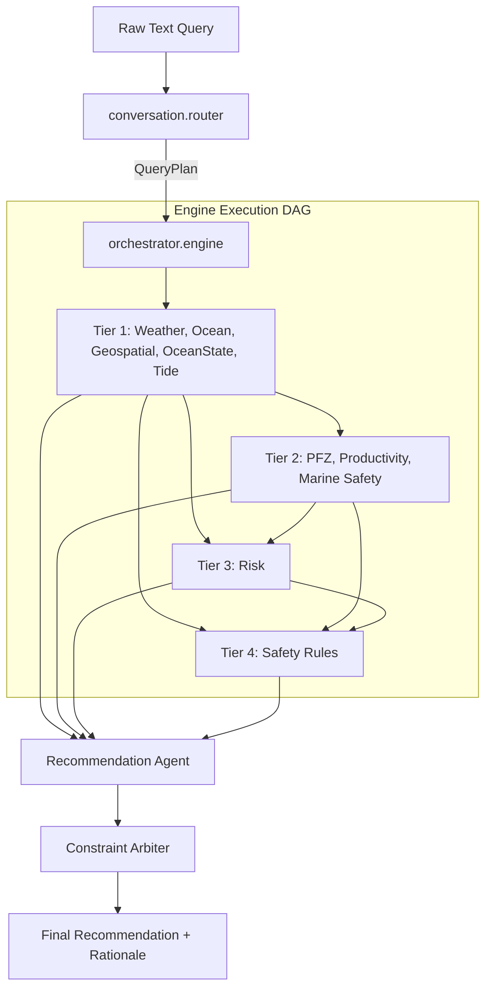

# agent-orchestration
> The central agent orchestration layer and intent router for the ORCA marine safety platform.

## Role within ORCA
This repository implements the agent orchestration and conversational routing layer of the broader ORCA platform. It is responsible for parsing natural-language user queries, extracting geospatial/temporal constraints, and orchestrating a DAG (Directed Acyclic Graph) of domain-specific marine AI agents to generate a unified, safe recommendation. 

This repository serves as the backend intelligence/orchestration component of the broader ORCA architecture. In its current standalone form, it is executed through `chat.py`; higher-level UI/API integration is outside this repository.

The relationship is approximately:
```text
User / Application (External UI)
      ↓
[This Repository: agent-orchestration]
  ├── Conversational Router (Intent & Entity Extraction)
  └── Orchestrator Engine (DAG Execution & Safety Arbiter)
      ↓
Domain Agents (Weather, Ocean, PFZ, Safety Rules, etc.)
      ↓
External Data Sources (IMD, INCOIS, Open-Meteo)
```

## Overview
The `agent-orchestration` component takes a raw user text input, uses a localized LLM (Qwen) to structure a `QueryPlan`, and executes a tier-based concurrent resolution of domain agents. It aggregates marine forecasts, calculates risk using embedded ML models (XGBoost/LSTM), checks strict safety heuristics, and synthesizes a final multilingual recommendation.

## Key Responsibilities
* **Intent Routing**: Translates user natural language (English, Bengali, Hinglish) into structured marine queries (`QueryPlan`).
* **Agent Orchestration**: Resolves dependencies between specialized agents and executes them concurrently using a ThreadPool.
* **Risk & Safety Arbitration**: Evaluates outputs against strict safety rules, forcibly aborting operations ("RETURN TO HARBOR") if conditions are catastrophic.
* **Multilingual Synthesis**: Generates conversational responses localized to the user's detected language.

## Architecture

This repository uses a two-stage architecture:
1. **Intake & Routing**: The query is parsed by the LLM Router, locations are resolved via the internal Gazetteer, and the exact required domain agents are identified.
2. **Engine Execution**: The Orchestrator resolves a dependency graph, executes the required agents in tiers, and passes their `AgentResult` context to a final `RecommendationAgent`.


*(Note: Actual tier placement dynamically varies based on the subset of agents required by the specific `QueryPlan` intent).*

## Components / Modules

| Component | Responsibility |
| --------- | -------------- |
| `orchestrator/` | DAG engine, tier-based concurrency, and final safety constraint application. |
| `conversation/` | Qwen-based router, intent detection, temporal/spatial parsing, state management. |
| `agents/` | Implementation of specialized domain agents (e.g., `PFZAgent`, `RiskAgent`). |
| `data_sources/` | Clients for external real-time data feeds. |
| `location/` | Gazetteer mapping strings to `GeoLocation` objects. |
| `schemas/` | Pydantic contracts ensuring type safety between agents and the engine. |

## Data / Inputs
* **Natural Language Queries**: Plain text from the user via CLI (e.g., "Is it safe to fish near Digha tomorrow?").
* **Conversation State**: Ongoing context, pending clarifications, and previously resolved locations (managed internally).
* **Configuration**: Environment variables dictating source preferences (e.g., live vs. fixture data).

## Outputs
* **`AgentResult`**: The standardized output contract for individual agents (includes status, data, confidence, sources, and warnings).
* **Final Recommendation**: A synthesized dictionary containing the `decision`, `risk_level`, `recommendation_text`, `why` (rationale), and `ranked_candidate_spots`.

## AI/ML Models
This repository directly loads and runs the following local models for inference from the `models/` directory:

| Model | File Name | Framework | Input | Output |
| ----- | --------- | --------- | ----- | ------ |
| **Qwen (Router)** | (Managed via HuggingFace/local caching) | Transformers | Raw Text | JSON Extraction / Reply Text |
| **PFZ Scorer** | `pfz/pfz_xgboost.json` | XGBoost | Distance, depth, time | Probability Score |
| **Marine Risk** | `marine_risk/marine_risk_xgboost_v2.json` | XGBoost | Wave, current, weather | Risk Category (Safe/Danger) |
| **Weather Risk** | `weather_risk/weather_risk_xgboost.json` | XGBoost | Wind, pressure, temp | Risk Category |
| **Ocean Suitability**| `ocean_suitability/ocean_suitability_hierarchical_xgboost.json`| XGBoost | Tides, waves, SST | Suitability Score |
| **Productivity** | `fish_productivity/fish_productivity_lstm_12m_env.keras` | LSTM (Keras) | Environmental features | Yield Prediction |

## External Data Sources

This repository directly integrates with these sources via the `data_sources/` module:

| Source | Data | Type | Fallback / Condition |
| ------ | ---- | ---- | -------------------- |
| **IMD** | District warnings, coastal bulletins, cyclone tracks | Live API | Open-Meteo |
| **INCOIS** | Potential Fishing Zones (PFZ) | Live HTML Scrape | Local Fixture (`pfz_zones.geojson`) |
| **Open-Meteo**| General weather (wind, temp, pressure, marine) | Live API | Used directly if IMD is disabled |

## Integration with ORCA
This repository acts as the backend intelligence core. It currently exposes a local CLI `chat.py` for direct interaction. It does not handle long-term database storage, user authentication, or UI rendering. In a full production deployment, it is intended to be wrapped by a separate API layer.

## Project Structure
```text
agent-orchestration/
├── agents/             # Domain agent implementations
├── conversation/       # Router, state, and LLM text generation
├── data/               # Static fixtures (e.g., pfz_zones.geojson)
├── data_sources/       # API clients for INCOIS, IMD, Open-Meteo
├── encoder/            # Tokenization pipelines
├── location/           # Gazetteer for coordinate resolution
├── models/             # Serialized XGBoost/Keras models
├── orchestrator/       # The DAG execution engine
├── schemas/            # Pydantic data contracts
├── chat.py             # CLI chat interface
├── main.py             # CLI entry and benchmark runner
└── requirements.txt    # Python dependencies
```

## Installation
1. **Clone the repository:**
   ```bash
   git clone <repository-url>
   cd agent-orchestration
   ```
2. **Set up the Python environment:**
   ```bash
   python -m venv .venv
   source .venv/bin/activate
   pip install -r requirements.txt
   ```

## Configuration
Use environment variables to configure external integrations. (Use a `.env` file or export them).

| Variable | Purpose | Required | Example |
| -------- | ------- | -------- | ------- |
| `IMD_API_KEY` | Bearer token for IMD APIs | Optional | `your_api_key_here` |
| `ORCA_PFZ_SOURCE` | Set to `live` (HTML scrape) or `fixture` (local GeoJSON) | Optional | `live` |
| `KMP_DUPLICATE_LIB_OK` | Resolves OpenMP conflicts for PyTorch/XGBoost on some systems. | Optional | `TRUE` |

## Usage
Run the interactive CLI interface to communicate with the orchestrator:
```bash
python chat.py
```

### Supported In-Chat Commands:
* `/reset` - Clear the current conversation state.
* `/debug` - Toggle detailed execution logs (agent latency, ML inference decisions, execution order).
* `/quit` or `/exit` - Exit the application.

**Example CLI flow:**
```text
You: kal digha fishing safe?
... [Orchestrator output] ...
🟢 RECOMMENDATION: RECOMMEND
   Risk Level: LOW | Confidence: 85%
```

## Testing / Benchmarking
A built-in regression benchmark suite exists to evaluate the router and agent orchestration accuracy.
```bash
python main.py --benchmark
```

## Performance
The orchestration architecture uses an internal latency budget/target of 5.0 seconds passed to the execution engine. Actual latency depends on LLM inference, external data-source response times, and model execution on your hardware. Latency profiling metrics are printed directly in the CLI when using the `/debug` command in `chat.py`.

## Limitations
* **Geospatial Bounds**: Geared heavily towards Indian coastal regions and the Bay of Bengal/Arabian Sea.
* **INCOIS Integration**: The `live` fetcher parses HTML directly from INCOIS. Structural changes to their website will break this integration, forcing it to fallback to cached or synthetic data.
* **Synchronous CLI**: This component currently provides a synchronous CLI (`chat.py`). It is not yet wrapped in an async web framework (e.g., FastAPI) within this repository.
